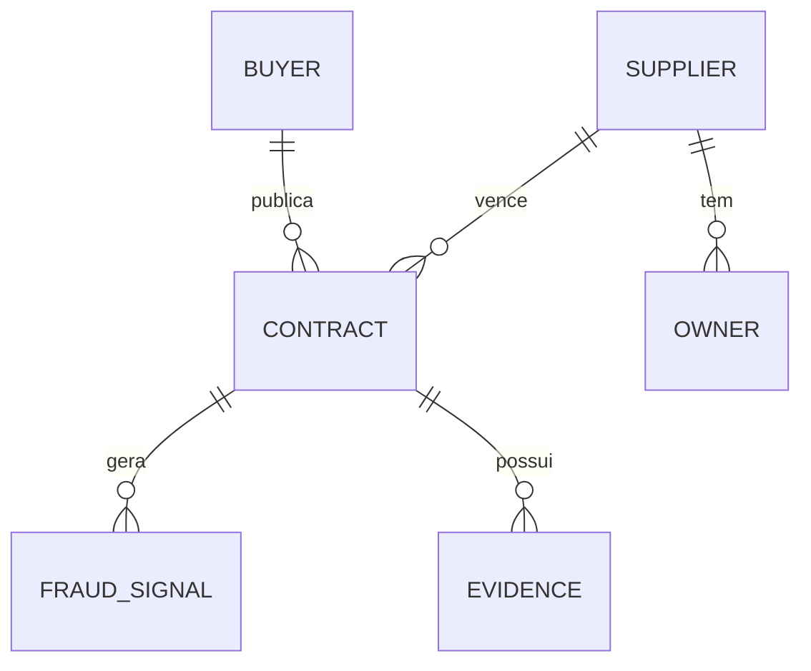
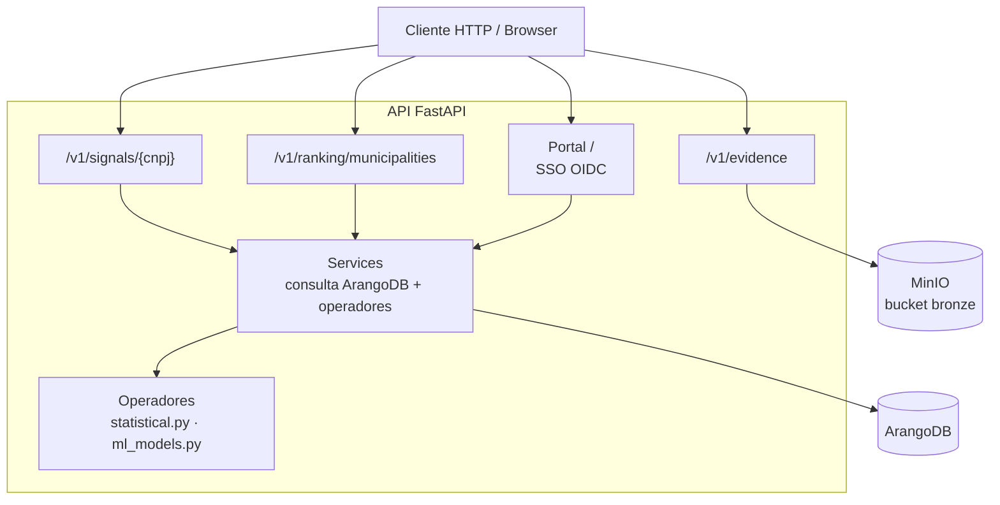

# API — Capiba

A API consulta o ArangoDB e executa os operadores de detecção
(`detection/statistical.py`, `detection/ml_models.py`) em tempo real.
Quando o ArangoDB está indisponível, todos os endpoints de dados retornam
`503` com `{"detail": "ArangoDB database unavailable"}`.
Os endpoints de evidência dependem do MinIO e, indisponível, retornam `503`
com `{"detail": "Evidence storage unavailable"}`.

## Modelo de dados

O grafo do Capiba relaciona compradores, fornecedores, contratos, sinais de
fraude e evidências.



## Componentes

A API FastAPI expõe rotas de consulta, o portal SSO e delega a lógica de
negócio aos serviços e operadores de detecção.



## Endpoints

### GET /health

Health check.

**Response:**

```json
{ "status": "ok" }
```

### GET /v1/signals/{cnpj}

Retorna sinais de risco para um CNPJ de fornecedor.

**Path params:**

- `cnpj` (string, required): CNPJ sem formatação (14 dígitos). Formato
  inválido retorna `422`.

**Comportamento:**

- CNPJ sem contratos no banco retorna `200` com `risk_index: 0.0`,
  `signals: []`, `alert: false`.
- Sinais emitidos (somente quando o respectivo limiar é atingido):
  - `single_bid` — taxa de contratos em modalidade não competitiva
    (dispensa/inexigibilidade, proxy de participante único) ≥ 0.5
  - `concentration` — HHI máximo do fornecedor entre seus compradores ≥ 0.25
  - `anomalous_price` — desvio da Lei de Benford (p < 0.05, mínimo 10 valores)
    ou taxa de anomalias IsolationForest ≥ 0.2 (mínimo 15 contratos)
  - `anomalous_duration` — proporção de contratos com vigência outlier (IQR)
    ≥ 0.2, mínimo 4 durações válidas
- `risk_index`: média ponderada dos sinais emitidos (pesos: single_bid
  0.35, concentration 0.35, anomalous_price 0.15, anomalous_duration 0.15),
  renormalizada sobre os sinais presentes.
- `alert`: `true` quando `risk_index >= 0.7`.

**Response:**

```json
{
  "entity": "12345678000195",
  "risk_index": 0.73,
  "signals": [
    { "type": "single_bid", "score": 0.91, "evidence": "91% dos contratos em modalidade não competitiva (dispensa/inexigibilidade)" },
    { "type": "concentration", "score": 0.68, "evidence": "HHI 0.68 de concentração no comprador 26000" }
  ],
  "alert": true
}
```

### GET /v1/ranking/municipalities

Retorna ranking de municípios por índice de risco, ordenado decrescente.

**Query params:**

- `uf` (string, optional): Filtro por estado
- `period_start` (date, optional): Data inicial (`YYYY-MM-DD`)
- `period_end` (date, optional): Data final (`YYYY-MM-DD`)
- `limit` (integer, default: 100, min 1, max 1000): Máximo de resultados

**Comportamento:**

- `risk_index` municipal = `0.5 * hhi + 0.5 * non_competitive_rate`,
  onde HHI é calculado sobre o valor total por fornecedor no município e a
  taxa considera modalidades dispensa/inexigibilidade.
- `period_start`/`period_end` na resposta repetem os filtros enviados; sem
  filtro, usam a data atual.

**Response:**

```json
{
  "period_start": "2026-01-01",
  "period_end": "2026-06-30",
  "ranking": [
    {
      "municipality": "Belo Horizonte",
      "uf": "MG",
      "risk_index": 0.82,
      "total_contracts": 150,
      "total_value": "2500000.00"
    }
  ]
}
```

## Portal (SSO via Keycloak)

O portal é servido pela própria API (`src/capiba/api/portal.py`) e usa SSO
OIDC contra o Keycloak (realm `capiba`, issuer público
`https://keycloak.capiba.local:8443/realms/capiba`). A sessão é um cookie
assinado (`SessionMiddleware`); com `SSO_ENABLED=false` (default local) o
portal abre sem login.

### GET /

Landing page do portal (dashboard com links para as UIs e estatísticas do
lake). Com SSO habilitado e sem sessão, redireciona `302` para
`/auth/login`.

### GET /auth/login

Inicia o fluxo OIDC (redirect para o Keycloak). Com SSO desabilitado,
redireciona de volta para `/`.

### GET /auth/callback

Callback do fluxo OIDC: valida o token (issuer público) e grava o
`userinfo` na sessão, redirecionando para `/`.

### GET /auth/logout

Limpa a sessão e redireciona para `/`.

## Evidências

Os endpoints de evidência (`EVIDENCE` no modelo de dados) gravam e servem
arquivos multimídia no bucket bronze do MinIO, sob
`evidence/<tipo>/<fonte>/<ano>/<mês>/<sha256>.<ext>`, com hash SHA-256 como
identificador de integridade. O storage é instanciado sob demanda: com o
MinIO indisponível, todos retornam `503`.

### POST /v1/evidence

Faz upload de um arquivo de evidência (multipart/form-data).

**Campos:**

- `file` (arquivo, required): conteúdo da evidência.
- `contract_id` (string, required): identificador do contrato.
- `entity_cnpj` (string, required): CNPJ da entidade relacionada.
- `evidence_type` (string, required): tipo de domínio (ex.: `invoice`,
  `contract_photo`).
- `source` (string, required): origem da evidência (ex.:
  `transparency_portal`, `on_site_inspection`).
- `captured_by` (string, required): agente/processo que capturou o arquivo.

`captured_at` e `hash_sha256` são preenchidos pelo servidor (o hash é
calculado sobre os bytes enviados).

**Erros:**

- `400`: metadados inválidos ou arquivo acima do limite do seu tipo
  (detalhe na mensagem).
- `422`: campo obrigatório ausente no formulário.
- `503`: storage indisponível.

**Response (201):**

```json
{
  "sha256": "9f2c…",
  "bucket": "capiba-bronze",
  "object_name": "evidence/document/transparency_portal/2026/02/9f2c….pdf",
  "type": "document",
  "size_bytes": 102400,
  "timestamp": "2026-02-01T00:00:00+00:00"
}
```

### GET /v1/evidence/contract/{contract_id}

Lista as evidências vinculadas a um contrato.

**Response:**

```json
[
  {
    "sha256": "9f2c…",
    "bucket": "capiba-bronze",
    "object_name": "evidence/document/transparency_portal/2026/02/9f2c….pdf",
    "type": "document",
    "filename": "invoice.pdf",
    "size": 102400,
    "timestamp": "2026-02-01T00:00:00+00:00"
  }
]
```

Contrato sem evidências retorna `200` com `[]`. Storage indisponível: `503`.

### GET /v1/evidence/{sha256}

Baixa o conteúdo de uma evidência pelo hash SHA-256
(`Content-Type: application/octet-stream`).

**Erros:**

- `404`: nenhuma evidência com o hash informado.
- `503`: storage indisponível.
