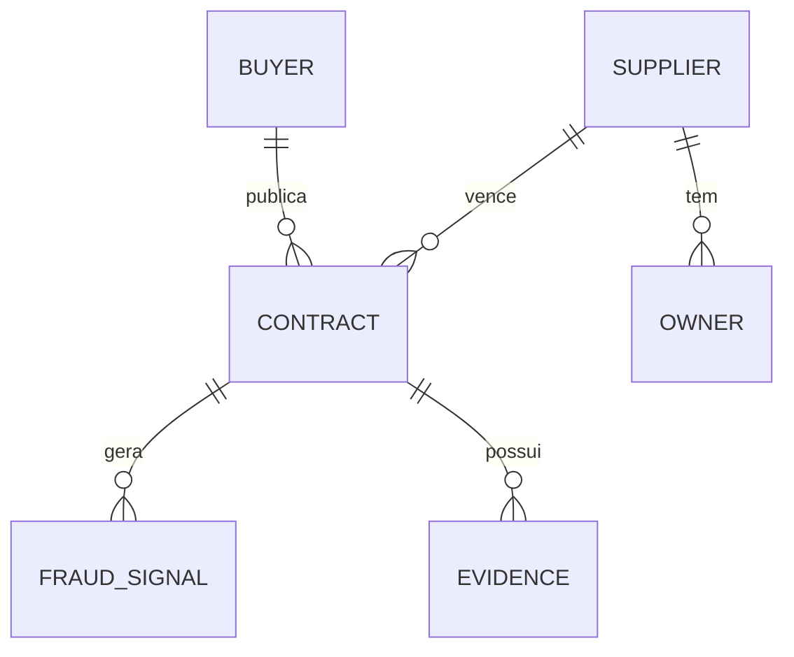
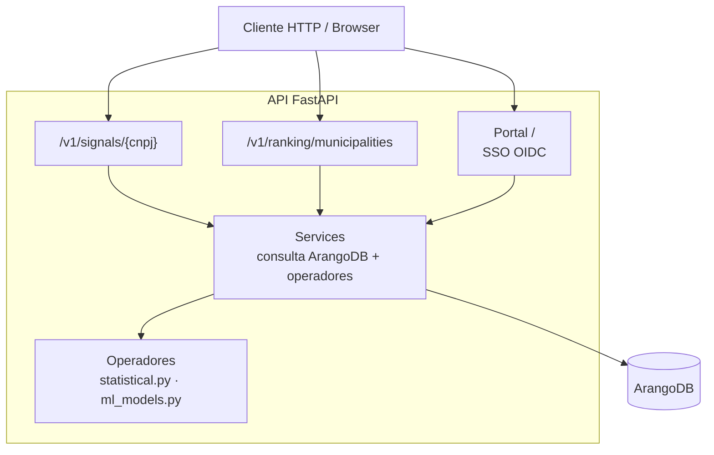

# API — Capiba

A API consulta o ArangoDB e executa os operadores de detecção
(`detection/statistical.py`, `detection/ml_models.py`) em tempo real.
Quando o ArangoDB está indisponível, todos os endpoints de dados retornam
`503` com `{"detail": "Banco de dados ArangoDB indisponível"}`.

## Modelo de dados

O grafo do Capiba relaciona compradores, fornecedores, contratos, sinais de
fraude e evidências.



## Componentes

A API FastAPI expõe rotas de consulta, o portal SSO e delega a lógica de
negócio aos serviços e operadores de detecção.



## Endpoints

### GET /health

Health check.

**Response:**

```json
{ "status": "ok" }
```

### GET /v1/signals/{cnpj}

Retorna sinais de risco para um CNPJ de fornecedor.

**Path params:**

- `cnpj` (string, required): CNPJ sem formatação (14 dígitos). Formato
  inválido retorna `422`.

**Comportamento:**

- CNPJ sem contratos no banco retorna `200` com `risk_index: 0.0`,
  `signals: []`, `alert: false`.
- Sinais emitidos (somente quando o respectivo limiar é atingido):
  - `single_bid` — taxa de contratos em modalidade não competitiva
    (dispensa/inexigibilidade, proxy de participante único) ≥ 0.5
  - `concentration` — HHI máximo do fornecedor entre seus compradores ≥ 0.25
  - `anomalous_price` — desvio da Lei de Benford (p < 0.05, mínimo 10 valores)
    ou taxa de anomalias IsolationForest ≥ 0.2 (mínimo 15 contratos)
  - `anomalous_duration` — proporção de contratos com vigência outlier (IQR)
    ≥ 0.2, mínimo 4 durações válidas
- `risk_index`: média ponderada dos sinais emitidos (pesos: single_bid
  0.35, concentration 0.35, anomalous_price 0.15, anomalous_duration 0.15),
  renormalizada sobre os sinais presentes.
- `alert`: `true` quando `risk_index >= 0.7`.

**Response:**

```json
{
  "entity": "12345678000195",
  "risk_index": 0.73,
  "signals": [
    { "type": "single_bid", "score": 0.91, "evidence": "91% dos contratos em modalidade não competitiva (dispensa/inexigibilidade)" },
    { "type": "concentration", "score": 0.68, "evidence": "HHI 0.68 de concentração no comprador 26000" }
  ],
  "alert": true
}
```

### GET /v1/ranking/municipalities

Retorna ranking de municípios por índice de risco, ordenado decrescente.

**Query params:**

- `uf` (string, optional): Filtro por estado
- `period_start` (date, optional): Data inicial (`YYYY-MM-DD`)
- `period_end` (date, optional): Data final (`YYYY-MM-DD`)
- `limit` (integer, default: 100, min 1, max 1000): Máximo de resultados

**Comportamento:**

- `risk_index` municipal = `0.5 * hhi + 0.5 * non_competitive_rate`,
  onde HHI é calculado sobre o valor total por fornecedor no município e a
  taxa considera modalidades dispensa/inexigibilidade.
- `period_start`/`period_end` na resposta repetem os filtros enviados; sem
  filtro, usam a data atual.

**Response:**

```json
{
  "period_start": "2026-01-01",
  "period_end": "2026-06-30",
  "ranking": [
    {
      "municipality": "Belo Horizonte",
      "uf": "MG",
      "risk_index": 0.82,
      "total_contracts": 150,
      "total_value": "2500000.00"
    }
  ]
}
```
