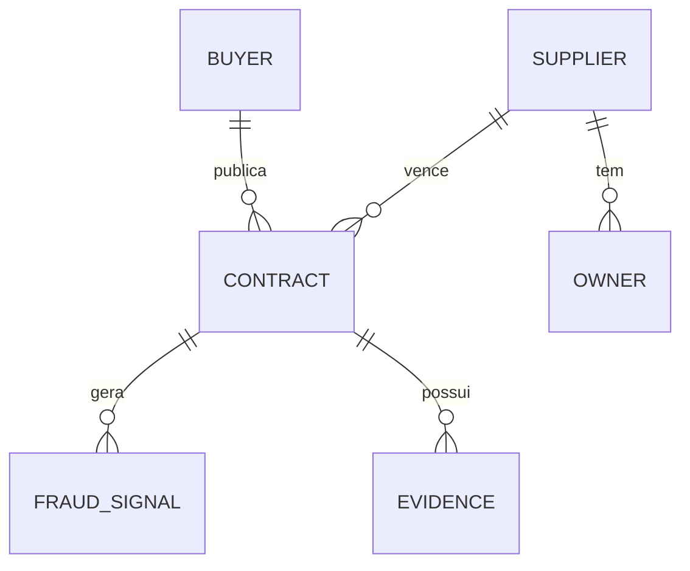
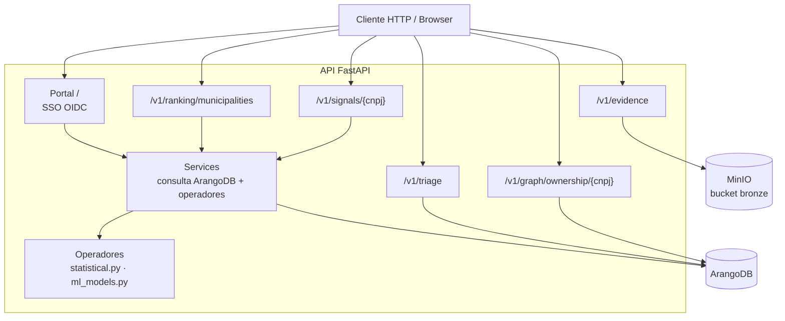

# API do Capiba

A API FastAPI é a voz da plataforma: consulta o ArangoDB, executa os
operadores de detecção em tempo real (`detection/signals.py` sobre
`detection/statistical.py` e `detection/ml_models.py`) e devolve os sinais
de risco em REST. Para não repetir trabalho pesado, as consultas quentes
passam pelo Redis quando ele está presente: os sinais de um CNPJ ficam em
cache por `REDIS_TTL_SIGNALS` e o ranking municipal por `REDIS_TTL_RANKING`;
sem Redis, tudo é computado a cada requisição, sem drama.

Quando o ArangoDB está indisponível, todos os endpoints de dados retornam
`503` com `{"detail": "ArangoDB database unavailable"}`. Os endpoints de
evidência dependem do MinIO e, indisponível, retornam `503` com
`{"detail": "Evidence storage unavailable"}`.

## Modelo de dados

O grafo do Capiba relaciona compradores, fornecedores, contratos, sinais de
fraude e evidências.



## Componentes

A API expõe rotas de consulta e o portal SSO, e delega a lógica de negócio
aos serviços e aos operadores de detecção.



## Endpoints

### GET /health

Health check.

**Response:**

```json
{ "status": "ok" }
```

### GET /v1/signals/{cnpj}

Retorna sinais de risco para um CNPJ de fornecedor.

**Path params:**

| Parâmetro | Tipo | Descrição |
|---|---|---|
| `cnpj` | string, obrigatório | CNPJ sem formatação (14 dígitos); formato inválido retorna `422` |

Um CNPJ sem contratos no banco retorna `200` com `risk_index: 0.0`,
`signals: []` e `alert: false`. Cada sinal só é emitido quando o respectivo
limiar é atingido:

| Sinal | Peso | Gatilho de emissão |
|---|---|---|
| `single_bid` | 0.35 | Taxa de contratos em modalidade não competitiva (dispensa/inexigibilidade, proxy de participante único) ≥ 0.5 |
| `concentration` | 0.35 | HHI máximo do fornecedor entre seus compradores ≥ 0.25 |
| `anomalous_price` | 0.15 | Desvio da Lei de Benford (p < 0.05, mínimo 10 valores positivos) ou taxa de anomalias IsolationForest ≥ 0.2 (mínimo 15 contratos) |
| `anomalous_duration` | 0.15 | Proporção de contratos com vigência outlier (IQR) ≥ 0.2, com mínimo de 4 durações válidas |

O `risk_index` é a média ponderada dos sinais emitidos, com os pesos da
tabela renormalizados sobre os sinais presentes; `alert` é `true` quando
`risk_index >= 0.7`.

**Response:**

```json
{
  "entity": "12345678000195",
  "risk_index": 0.73,
  "signals": [
    { "type": "single_bid", "score": 0.91, "evidence": "91% dos contratos em modalidade não competitiva (dispensa/inexigibilidade)" },
    { "type": "concentration", "score": 0.68, "evidence": "HHI 0.68 de concentração no comprador 26000" }
  ],
  "alert": true
}
```

### GET /v1/ranking/municipalities

Retorna o ranking de municípios por índice de risco, em ordem decrescente.

**Query params:**

| Parâmetro | Tipo | Descrição |
|---|---|---|
| `uf` | string, opcional | Filtro por estado |
| `period_start` | date, opcional | Data inicial (`YYYY-MM-DD`) |
| `period_end` | date, opcional | Data final (`YYYY-MM-DD`) |
| `limit` | integer, opcional | Máximo de resultados (default 100, mínimo 1, máximo 1000) |

O `risk_index` municipal é `0.5 * hhi + 0.5 * non_competitive_rate`,
limitado a 1.0: o HHI é calculado sobre o valor total por fornecedor no
município e a taxa considera as modalidades dispensa/inexigibilidade. Os
campos `period_start` e `period_end` da resposta repetem os filtros
enviados; sem filtro, usam a data atual.

**Response:**

```json
{
  "period_start": "2026-01-01",
  "period_end": "2026-06-30",
  "ranking": [
    {
      "municipality": "Belo Horizonte",
      "uf": "MG",
      "risk_index": 0.82,
      "total_contracts": 150,
      "total_value": "2500000.00"
    }
  ]
}
```

## Grafo

### GET /v1/graph/ownership/{cnpj}

Traça a cadeia de titularidade (beneficial ownership) de uma empresa,
seguindo as arestas `owns` do grafo ArangoDB (`trace_ownership` em
`detection/graphs.py`, semântica validada pela bateria D-02).

**Path params:**

| Parâmetro | Tipo | Descrição |
|---|---|---|
| `cnpj` | string, obrigatório | CNPJ sem formatação (14 dígitos); formato inválido retorna `422` |

**Query params:**

| Parâmetro | Tipo | Descrição |
|---|---|---|
| `max_depth` | integer, opcional | Profundidade máxima da travessia (default 3, mínimo 1, máximo 10) |

Um CNPJ sem arestas `owns` retorna `200` com `paths: []`. Os caminhos são
simples (sem vértice repetido, ciclos bloqueados) e ordenados
deterministicamente, com o vértice inicial incluído. Se o ArangoDB estiver
indisponível, o endpoint responde `503`.

**Response:**

```json
{
  "entity": "12345678000195",
  "max_depth": 3,
  "paths": [
    ["12345678000195", "partner-cpf-1"],
    ["12345678000195", "partner-cpf-1", "98765432000100"]
  ]
}
```

## Portal (SSO via Keycloak)

O portal é servido pela própria API (`src/capiba/api/portal.py`) e usa SSO
OIDC contra o Keycloak (realm `capiba`, issuer público
`https://keycloak.capiba.local:8443/realms/capiba`). A sessão é um cookie
assinado (`SessionMiddleware`); com `SSO_ENABLED=false` (default local) o
portal abre sem login. As rotas do portal e do fluxo de autenticação:

| Rota | Papel |
|---|---|
| `GET /` | Landing page do portal (dashboard com links para as UIs e estatísticas do lake); com SSO habilitado e sem sessão, redireciona `302` para `/auth/login` |
| `GET /auth/login` | Inicia o fluxo OIDC (redirect para o Keycloak); com SSO desabilitado, redireciona de volta para `/` |
| `GET /auth/callback` | Callback do fluxo OIDC: valida o token (issuer público), grava o `userinfo` na sessão e redireciona para `/` |
| `GET /auth/logout` | Limpa a sessão e redireciona para `/` |
| `GET /triage` | Página de triagem editorial (O10): fila de sinais por estado (`?status=`), ações de confirmar/rejeitar/publicar e relatório de precisão por operador; degrada para "indisponível" com o ArangoDB fora |
| `POST /triage/review` | Aplica a transição editorial vinda do formulário da página (revisor do campo ou da sessão SSO); erros de validação voltam como banner na fila (redirect 303), nunca como página 4xx |

## Evidências

Os endpoints de evidência (`EVIDENCE` no modelo de dados) gravam e servem
arquivos multimídia no bucket bronze do MinIO, sob
`evidence/<tipo>/<fonte>/<ano>/<mês>/<sha256>.<ext>`, com o hash SHA-256
como identificador de integridade. O storage é instanciado sob demanda:
com o MinIO indisponível, todos retornam `503`.

### POST /v1/evidence

Faz upload de um arquivo de evidência (multipart/form-data).

**Campos:**

| Campo | Tipo | Descrição |
|---|---|---|
| `file` | arquivo, obrigatório | Conteúdo da evidência |
| `contract_id` | string, obrigatório | Identificador do contrato |
| `entity_cnpj` | string, obrigatório | CNPJ da entidade relacionada |
| `evidence_type` | string, obrigatório | Tipo de domínio (ex.: `invoice`, `contract_photo`) |
| `source` | string, obrigatório | Origem da evidência (ex.: `transparency_portal`, `on_site_inspection`) |
| `captured_by` | string, obrigatório | Agente/processo que capturou o arquivo |

`captured_at` e `hash_sha256` são preenchidos pelo servidor (o hash é
calculado sobre os bytes enviados).

**Erros:**

| Código | Quando |
|---|---|
| `400` | Metadados inválidos ou arquivo acima do limite do seu tipo (detalhe na mensagem) |
| `422` | Campo obrigatório ausente no formulário |
| `503` | Storage indisponível |

**Response (201):**

```json
{
  "sha256": "9f2c…",
  "bucket": "capiba-bronze",
  "object_name": "evidence/document/transparency_portal/2026/02/9f2c….pdf",
  "type": "document",
  "size_bytes": 102400,
  "timestamp": "2026-02-01T00:00:00+00:00"
}
```

### GET /v1/evidence/contract/{contract_id}

Lista as evidências vinculadas a um contrato. Um contrato sem evidências
retorna `200` com `[]`; storage indisponível responde `503`.

**Response:**

```json
[
  {
    "sha256": "9f2c…",
    "bucket": "capiba-bronze",
    "object_name": "evidence/document/transparency_portal/2026/02/9f2c….pdf",
    "type": "document",
    "filename": "invoice.pdf",
    "size": 102400,
    "timestamp": "2026-02-01T00:00:00+00:00"
  }
]
```

### GET /v1/evidence/{sha256}

Baixa o conteúdo de uma evidência pelo hash SHA-256
(`Content-Type: application/octet-stream`).

**Erros:**

| Código | Quando |
|---|---|
| `404` | Nenhuma evidência com o hash informado |
| `503` | Storage indisponível |

### GET /v1/signals/{key}/evidence

Lista os pacotes de evidência reproduzíveis (O9) de um sinal, onde `key` é
a chave de triagem `{entity_type}:{entity_id}:{signal_type}` (O10). O
`task_detect` grava, a cada run, um pacote de lote (linhas silver da run +
`source_rows_sha256` + janela + versão do código) e um manifesto por sinal
referenciando o lote via `batch_sha256` — o download do conteúdo segue pelo
`GET /v1/evidence/{sha256}`. Nesses pacotes, o metadado `signal_key`
substitui o `contract_id` obrigatório. Sinais derivados de grafo
(`collusion_network`) são marcados `reproducible: false` no manifesto.

**Response:** mesma estrutura da listagem por contrato, acrescida de
`signal_key` e `batch_sha256`.

**Erros:**

| Código | Quando |
|---|---|
| `503` | Storage indisponível |

## Triagem editorial

A triagem é a fila editorial dos sinais detectados (O10): o `task_detect`
registra cada sinal na coleção ArangoDB `signal_reviews` com estado
`pending_review`, sob a chave estável `{entity_type}:{entity_id}:{signal_type}`;
assim a triagem sobrevive à recomputação diária, que apenas atualiza score
e details. Toda transição exige revisor, o descarte exige motivo e
`published` é terminal. Os rótulos humanos alimentam o relatório de
precisão por operador e, futuramente, o ML supervisionado.

### GET /v1/triage/signals

Lista os sinais em triagem, mais recentes primeiro.

**Query params:**

| Parâmetro | Tipo | Descrição |
|---|---|---|
| `status` | string, opcional | `pending_review`, `confirmed`, `rejected` ou `published` |
| `signal_type` | string, opcional | Filtro por tipo de sinal |
| `limit` | integer, opcional | Máximo de resultados (default 100, mínimo 1, máximo 1000) |

**Response:** lista de entradas com `key`, `entity_type`, `entity_id`,
`signal_type`, `score`, `details`, `status`, `reviewed_by`, `reviewed_at`,
`reason`, `first_seen` e `last_seen`.

**Erros:** `422` (parâmetros inválidos), `503` (ArangoDB indisponível).

### POST /v1/triage/signals/{key}/review

Aplica uma transição editorial a um sinal. As transições permitidas são
`pending_review` para `confirmed` ou `rejected`, `confirmed` para
`published` ou `rejected`, e `rejected` de volta para `confirmed`;
`published` é terminal. O `reviewer` é obrigatório em toda transição e o
`reason` é obrigatório no `rejected`.

**Body:**

```json
{ "status": "rejected", "reviewer": "ana", "reason": "falso positivo" }
```

**Erros:** `404` (sinal não registrado), `422` (transição inválida ou
revisor/motivo ausente), `503` (ArangoDB indisponível).

### GET /v1/triage/metrics

Relatório de precisão por operador derivado dos rótulos humanos:
contagens por status e `precision = confirmed / (confirmed + rejected)`
(`null` sem rótulos).
