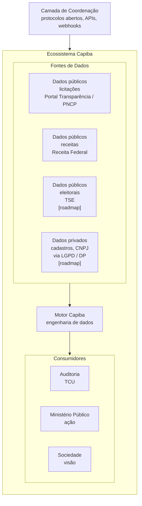
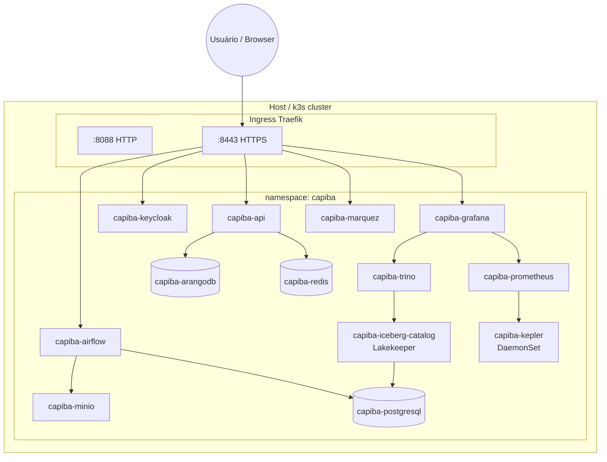
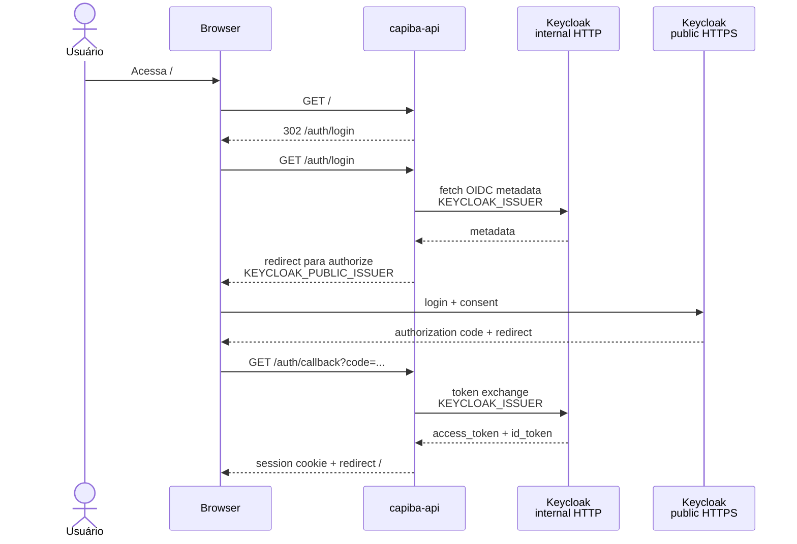

# Arquitetura do Capiba

## Visão geral

Capiba é um motor de detecção de farsa institucional que transforma
canais de dados públicos em sinais de corrupção, a serviço do
**jornalismo de dados comunitário**: os sinais existem para embasar
investigações de interesse público, não como fim em si mesmos. O processo
editorial completo (obter, compreender, verificar, documentar, analisar,
confirmar e publicar) está mapeado para os componentes da plataforma em
`docs/jornalismo_dados.md`.

No limite, o objetivo é construir **comunidades de dados**: empresas,
clientes e instituições públicas compartilham dados para produzir
**inteligência soberana em território nacional**, uma alternativa
comunitária às plataformas estrangeiras de imperialismo de dados e
hipervigilância global. Os protocolos de compartilhamento federado
(privacidade diferencial, federated learning, zero-knowledge proofs) da
seção de roadmap sustentam essa visão: contribuir sem abrir mão da
soberania sobre os próprios dados.

## Camadas

Fontes com pipeline hoje: PNCP e Portal da Transparência (pipeline diário) e
Receita Federal (pipeline mensal `monthly_federal_revenue`, que baixa o dump
CNPJ para o bronze e, quando os arquivos Empresas/Estabelecimentos/Socios
estão habilitados via `FEDERAL_REVENUE_FILES`, normaliza em streaming para
as tabelas silver `companies`/`establishments`/`partners` e carrega o grafo
ArangoDB com vértices `companies`/`partners` e arestas `partner_of`). As
listas de sanções CEIS/CNEP do Portal da Transparência entram pelo pipeline
semanal `weekly_sanctions` (fórmula `entities_collect`, tabela silver
`sanctions`). TSE e dados privados via LGPD/DP são visão de longo prazo, sem
implementação.

## Protocolos de compartilhamento (roadmap)

A tabela abaixo descreve a visão de compartilhamento federado; nenhum desses
protocolos está implementado no código atual.

| Protocolo             | Função                                     |
| --------------------- | ------------------------------------------ |
| Differential privacy  | Agregados ruidosos, não dados brutos       |
| Federated learning    | Modelos treinados localmente               |
| Zero-knowledge proofs | Prova de compliance sem revelar identidade |
| APIs abertas          | Consumo de sinais por qualquer instituição |

A governança de dados que prepara a plataforma para essa federação (mapeamento
DAMA-DMBOK, papéis, régua regulatória LGPD/LAI) está documentada em
`docs/governanca.md`.

## Stack técnica

A casa se mantém em ordem pelo Apache Airflow, que orquestra pipelines de
ingestão declarativos: specs YAML em `dags/pipelines/*.yaml`, uma DAG gerada
por spec pelo factory `dags/pipeline_factory.py` (detalhes em
`docs/ingestao.md`). O storage mora no ArangoDB (multi-modelo, único banco
da aplicação) e no MinIO, com o Redis segurando o cache do monitor de
qualidade e dos hot paths da API: habilitado por padrão, e tudo degrada
graciosamente quando ele sai de cena. O ML é scikit-learn com spaCy, a API
é FastAPI e a visualização é Grafana, com SSO via Keycloak e datasource
Trino provisionado.

O coração é um lago Apache Iceberg, tabelas Parquet no MinIO com catálogo
REST Lakekeeper sobre PostgreSQL. O Trino pergunta em SQL sobre o catálogo
Iceberg REST (um catálogo por warehouse: bronze/silver/gold) e é a fonte de
dados do Grafana para os marts; expõe ainda o catálogo `dwh` (connector
PostgreSQL), usado pelo dbt para materializar os modelos de serving no DW.
As transformações silver→gold são dbt (dbt-trino, executadas pelo Trino
sobre o catálogo gold), e a linhagem é catalogada pelo Marquez (lineage via
OpenLineage, metastore no PostgreSQL do chart), com o dbt docs documentando
os marts gold.

O PostgreSQL do chart é o único banco relacional e veste dois uniformes:
metastore do Airflow, do Grafana, do Keycloak, do Lakekeeper e do Marquez,
e também DW complementar (database `dwh`, criado por job hook idempotente),
que recebe os modelos de serving de `dbt/models/serving/`
(`serving_supplier_stats`, `serving_municipality_daily`) como camada de
baixa latência para consumo direto, separada do lake analítico.

Quem vigia a casa: o Prometheus (retenção 7d, TSDB em emptyDir, perfil dev)
scrapeia o kubelet/cAdvisor do k3s e o Kepler (DaemonSet, estimativa de
energia por pod na porta 28282), com dashboards como código em
`charts/capiba/dashboards/` (infra, energia, ingestão e custos) montados no
Grafana via ConfigMap. E a porta de entrada única é o Keycloak (realm
`capiba`): portal da API, Grafana, Airflow, MinIO Console, Lakekeeper UI e
Headlamp compartilham o mesmo login OIDC, enquanto os clientes de máquina
(Trino, pyiceberg) usam o client `capiba-services` (client_credentials).

## Deploy no k3s

O ambiente local roda em um cluster k3s nativo, exposto pelo ingress Traefik
nos hostPorts `8088` (HTTP) e `8443` (HTTPS, certificado self-signed para
`*.capiba.local`). Todos os serviços compartilham o namespace `capiba`.

## Fluxo de autenticação SSO

O Keycloak atua como IdP OIDC para o portal da API e para as UIs do cluster.
Como os pods não confiam no certificado self-signed do Traefik na porta `8443`,
o backchannel de metadados usa o issuer interno/plain HTTP
(`KEYCLOAK_ISSUER`), enquanto o navegador redireciona pelo ingress público
HTTPS (`KEYCLOAK_PUBLIC_ISSUER`).

## Persistência e storage

No host, a persistência se divide em duas pastas na raiz do projeto. A
`data/` é a raiz de armazenamento do MinIO, onde cada subdiretório de
primeiro nível é um bucket; a `services/` abriga os bancos que não rodam
sobre object storage (ArangoDB, PostgreSQL e Redis), via PVs `hostPath`
gerenciados pelo chart.

O MinIO organiza o data lake em buckets no modelo medallion, com tabelas
Iceberg (Parquet) catalogadas pelo Lakekeeper, o REST catalog do cluster,
um warehouse por bucket: `bronze`, `silver` e `gold`. O `capiba-bronze`
guarda os payloads brutos das APIs (`<fonte>/dt=YYYY-MM-DD/`, cópia de
auditoria), as tabelas Iceberg `raw_<fonte>` e os arquivos de evidência
(`evidence/<formato>/<origem>/AAAA/MM/<sha256>.<ext>`, formato ∈
image/document/audio/video/other). O `capiba-silver` abriga a tabela Iceberg
`capiba.contracts` (contratos normalizados, particionada por `dt`) e as
tabelas de entidades `companies`/`establishments`/`partners` (dump CNPJ da
Receita) e `sanctions` (listas CEIS/CNEP do Portal da Transparência). O
`capiba-gold` reúne os relatórios por execução
(`reports/daily_ingestion/dt=YYYY-MM-DD/`), os marts Iceberg gerados pelo
dbt (`capiba.contracts_daily`, `capiba.contracts_by_agency`,
`capiba.supplier_stats`, `capiba.data_quality_daily`,
`capiba.pod_usage_hourly`, `capiba.platform_cost_daily`), a tabela
`capiba.platform_metrics` (métricas por passo de cada run, escritas pelo
runner) e a tabela `capiba.fraud_signals` (sinais estatísticos do post step
`detect`). O `detect` e a validação dos pipelines disparam alertas
best-effort por e-mail (`src/capiba/notification/alerts.py`) quando
`NOTIFICATION_RECIPIENTS` está configurado.

Além do lake: `capiba-airflow-logs` recebe os logs remotos das tasks do
Airflow, `capiba-artifacts` recebe o código (`src/`) e as DAGs publicados
por `make publish-artifacts` (sincronizados aos pods do Airflow por init
container e sidecar, sem rebuild de imagem) e `capiba-backups` recebe os
dumps diários do CronJob `capiba-backup` (`pg_dump` dos bancos airflow,
keycloak, lakekeeper e marquez, mais `arangodump` do database `capiba`, em
`dt=YYYY-MM-DD/{postgresql,arangodb}/`).

O layout completo de buckets é criado de forma idempotente por
`make init-buckets`.
