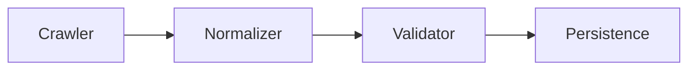
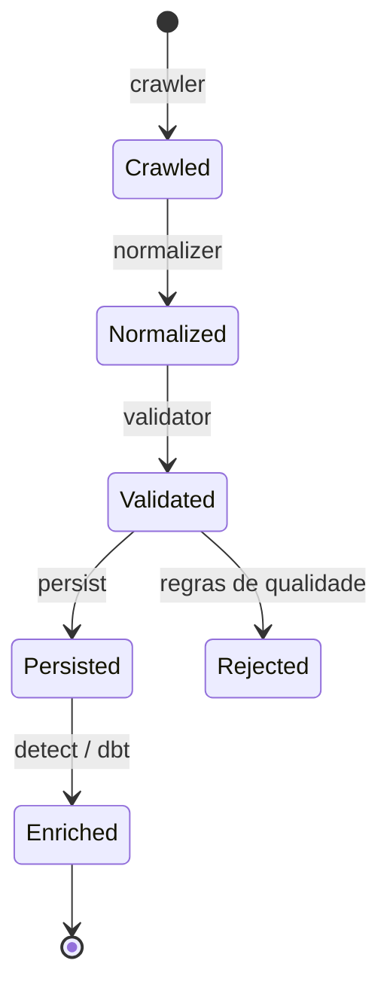
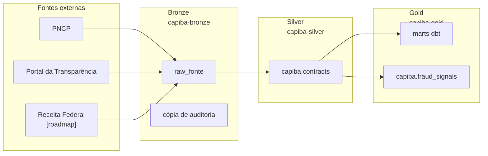

# Ingestão de Dados — Capiba

## Visão geral

A camada de ingestão é responsável por extrair dados públicos de contratações
governamentais, normalizá-los em um schema unificado e persisti-los no grafo
do Capiba.



## Fontes suportadas

### PNCP

- **Endpoint:** `GET /v1/contratos` (contratos já firmados, com fornecedor e valores)
- **Paginação e retry:** implementados no crawler; detalhes da API (URL base, formato de data, limites, rate limit) em `docs/apis_fontes.md`
- Retry com backoff exponencial compartilhado em `src/capiba/ingestion/_http.py`

### Portal da Transparência

- **Endpoint:** `GET /contratos` (por período e código SIAFI do órgão); `fetch_purchases` itera mês a mês sobre o mesmo endpoint
- **Autenticação:** header `chave-api-dados` (ver `docs/apis_fontes.md`)
- **Mapeamento:** defensivo, suporta variações de nomenclatura

## Schema unificado

### `Contract`

| Campo | Tipo | Descrição |
|-------|------|-----------|
| `id` | `str` | Identificador único |
| `process_number` | `str` | Número do processo administrativo |
| `subject` | `str` | Descrição do objeto contratado |
| `amount` | `Decimal` | Valor homologado/global |
| `signature_date` | `date` | Data de assinatura |
| `validity_start` | `date` | Início da vigência |
| `validity_end` | `date` | Fim da vigência |
| `buyer` | `Buyer` | Órgão público contratante |
| `supplier` | `Supplier` | Empresa/pessoa física contratada |
| `modality` | `str` | Modalidade da contratação |
| `status` | `str` | Situação do contrato |

## CLI de ingestão manual

O script `scripts/ingestion.py` é um wrapper fino sobre o framework
declarativo (`capiba.pipeline.runner`): monta uma spec em memória para as
fontes escolhidas e executa a fórmula `contracts_default` com a janela
explícita informada, sem depender do Airflow. O modo `--mock` usa dados de
exemplo (fontes `mock_pncp`/`mock_transparency`) em vez de chamar as APIs
externas, e `--dry-run` pula a persistência no ArangoDB (as escritas no
lake continuam best-effort):

```bash
# Simulação (dry-run)
python scripts/ingestion.py \
  --source pncp \
  --start-date 2026-01-01 \
  --end-date 2026-01-01 \
  --dry-run

# Persistir no ArangoDB
python scripts/ingestion.py \
  --source both \
  --start-date 2026-01-01 \
  --end-date 2026-01-31 \
  --persist
```

### Parâmetros

| Parâmetro | Valores | Descrição |
|-----------|---------|-----------|
| `--source` | `pncp`, `transparency`, `both` | Fonte de dados |
| `--start-date` | `YYYY-MM-DD` | Data inicial |
| `--end-date` | `YYYY-MM-DD` | Data final |
| `--dry-run` | flag | Não persiste no banco |
| `--persist` | flag | Habilita persistência no ArangoDB (dry-run desativa) |
| `--mock` | flag | Usa dados de exemplo em vez de chamar APIs externas |

## Pipelines declarativos (specs YAML)

Os pipelines de ingestão são **declarativos**: cada um é uma spec YAML em
`dags/pipelines/*.yaml`, sem código Python. No parse do Airflow,
`dags/pipeline_factory.py` carrega e valida cada spec
(`capiba.pipeline.spec.load_spec`) e gera uma DAG por spec — uma única task
`run` que executa o runner (`src/capiba/pipeline/runner.py`). Uma spec
inválida é logada e pulada, sem derrubar o restante do DagBag. Inlets e
outlets OpenLineage são derivados da própria spec, alimentando o Marquez.

```yaml
# dags/pipelines/daily_contracts.yaml — pipeline diário de contratos públicos
name: daily_ingestion           # vira o dag_id (snake_case)
description: Daily ingestion of public contracts and bids
schedule: "0 6 * * *"           # cron do Airflow; omita para pipeline manual
window: previous_day            # janela temporal padrão das fontes
sources:
  - name: pncp                  # fonte do SOURCE_REGISTRY
  - name: transparency
    window: current_month       # override de janela só desta fonte
formula: contracts_default      # fórmula que orquestra os passos
validate:
  ruleset: contract_rules       # regras de qualidade (opcional)
transformations:                # transformações nomeadas (opcional)
  - name: filter_by_min_value
    params: { min_value: 1000 }
destinations:
  - lake_bronze                 # cópia de auditoria + tabela raw_<fonte>
  - lake_silver                 # tabela Iceberg capiba.contracts
  - arangodb_graph              # upsert das entidades no grafo
  - gold_report                 # relatório do run no bucket gold
post_steps:
  - dbt_run                     # marts gold via dbt
  - detect                      # sinais estatísticos de fraude no gold
```

### Registries

Os nomes do YAML resolvem para implementações via
`src/capiba/pipeline/registry.py`:

- **Fontes** (`SOURCE_REGISTRY`): `pncp`, `transparency`, `federal_revenue`
  (dump de arquivos), `pod_usage` (metrics-server), `mock_pncp`,
  `mock_transparency`.
- **Normalizadores** (`NORMALIZER_REGISTRY`): mapeamento raw → `Contract`
  por fonte (as fontes mock reutilizam o normalizador da fonte que imitam).
- **Rulesets** (`RULESET_REGISTRY`): `contract_rules`
  (`src/capiba/quality/validators.py`).
- **Fórmulas e destinos** (`FORMULA_REGISTRY`/`DESTINATION_REGISTRY`):
  registrados pelo próprio runner ao ser importado.

Para declarar uma fonte nova basta o YAML; para registrar uma capacidade
nova (fonte, normalizador, ruleset, fórmula ou destino) é preciso Python —
o registry é a fronteira entre os dois mundos.

### Fórmulas

- **`contracts_default`**: crawl por fonte (cada uma com sua janela) →
  normalize → transformations (opcional) → validate (opcional) → destinos.
  Espelha o fluxo diário de contratos.
- **`file_dump`**: download de arquivos de referência (ex.: dump CNPJ da
  Receita Federal) → ZIPs no bronze + manifesto; manifesto vazio falha o
  run — uma ausência não pode ser registrada como sucesso.
- **`metrics_collect`**: snapshot pontual de métricas (ex.: `pod_usage`)
  direto para os destinos, sem normalização nem validação; a janela é
  ignorada.

### Janelas temporais

`src/capiba/pipeline/window.py` resolve os nomes declarados em um
`DateRange` a partir da execution date: `previous_day`, `current_month`,
`previous_month` e `all` (ilimitada). O `window` do pipeline é o padrão;
cada fonte pode sobrescrevê-lo (como o Portal da Transparência, coletado
pelo mês corrente inteiro no pipeline diário).

### Transformações customizadas

Transformações nomeadas vivem em `src/capiba/transformations/` — um módulo
por transformação, expondo `transform(records, **params)` — e são
referenciadas por nome no YAML, com `params` livres. Nomes fora do
`TRANSFORMATION_REGISTRY` são resolvidos importando
`capiba.transformations.<name>`.

### Validação da spec

Antes de qualquer execução, a spec passa por duas validações: estrutural
(pydantic, `extra="forbid"` — chave desconhecida falha) e cruzada com os
registries (fonte/fórmula/destino/ruleset/transformação desconhecidos geram
erro claro, com a lista de nomes conhecidos). Em runtime, o ruleset
declarado produz resultados por regra no relatório do run (destino
`gold_report`), e o runner registra métricas por passo (duração, linhas
de entrada/saída, erros) na tabela gold `platform_metrics`.

### DAGs atuais

- **`daily_ingestion`** (`daily_contracts.yaml`, `0 6 * * *`): PNCP +
  Transparência → bronze, silver, grafo ArangoDB e relatório gold; post
  steps `dbt_run` (marts) e `detect`. O `detect` calcula sinais
  estatísticos de fraude sobre a tabela silver (desvio de Benford por
  fornecedor, concentração HHI por órgão, vigências atípicas) e os
  materializa na tabela Iceberg gold `capiba.fraud_signals`.
- **`monthly_federal_revenue`** (`monthly_federal_revenue.yaml`,
  `23 5 2 * *`): baixa os arquivos de referência do dump CNPJ da Receita
  do mês anterior (fórmula `file_dump`, subset via `FEDERAL_REVENUE_FILES`
  ou `params.files`), grava os ZIPs em
  `federal_revenue/files/dt=YYYY-MM-DD/` no bronze e registra o manifesto
  na tabela `capiba.raw_federal_revenue`.
- **`hourly_pod_usage`** (`hourly_pod_usage.yaml`, `7 * * * *`): coleta o
  uso de CPU/memória dos pods do namespace (fórmula `metrics_collect`,
  fonte `pod_usage`), insumo dos marts `pod_usage_hourly` e
  `platform_cost_daily`.
- **`lake_maintenance`** (`dags/lake_maintenance.py`, semanal): única DAG
  imperativa restante — executa `expire_snapshots` (retenção de 7 dias) e
  `optimize` (compactação) em todas as tabelas Iceberg dos catálogos
  bronze/silver/gold, via Trino.

## Persistência no grafo

Contratos são salvos na collection `contracts`. Fornecedores são salvos em
`suppliers` e conectados via aresta `won`. Compradores são salvos em
`buyers`.

## Ciclo de vida de um contrato

Um contrato percorre as etapas do pipeline desde a coleta até a enriquecimento
com sinais de fraude.



## Data lake (medallion + Iceberg)

Em paralelo ao grafo, o pipeline (`src/capiba/pipeline/lake.py`) grava no
MinIO em modelo medallion, com dois formatos por camada:



- **Bronze** (`capiba-bronze`):
  - cópia de auditoria bruta: `<fonte>/dt=YYYY-MM-DD/*.json.gz`
  - tabela Iceberg `capiba.raw_<fonte>` (uma linha por execução, payload
    completo em `payload_json`), particionada por `dt`
- **Silver** (`capiba-silver`): tabela Iceberg `capiba.contracts` — contratos
  normalizados e tipados (datas, `decimal(18,2)`, structs `buyer`/`supplier`),
  particionada por `dt`
- **Gold** (`capiba-gold`):
  - relatórios de execução em `reports/daily_ingestion/dt=YYYY-MM-DD/*.json.gz`
  - marts Iceberg construídos pelo dbt (`capiba.contracts_daily`,
    `capiba.contracts_by_agency`, `capiba.supplier_stats`,
    `capiba.data_quality_daily`, `capiba.pod_usage_hourly`,
    `capiba.platform_cost_daily`)
  - tabela `capiba.platform_metrics` (métricas por passo de cada run,
    escritas pelo runner, best-effort)
- **Serving** (PostgreSQL DWH): os modelos de `dbt/models/serving/`
  (`serving_supplier_stats`, `serving_municipality_daily`) são
  materializados no database `dwh` através do catálogo Trino `dwh` —
  camada de baixa latência para consumo direto, fora do lake

As tabelas Iceberg (arquivos Parquet + metadados) são catalogadas pelo
**Lakekeeper** (REST catalog, serviço `capiba-iceberg-catalog` no cluster),
com um warehouse por bucket (`bronze`, `silver`, `gold`), provisionados por
`make init-buckets`. Os clientes Python usam `pyiceberg`; o dbt usa
`dbt-trino`, executando todo o SQL pelo **Trino** (um catálogo por warehouse)
contra o catálogo gold.

Para rodar sem cluster, basta apontar `ICEBERG_CATALOG_URI` para um catálogo
SQLite local (`sqlite:////caminho/catalog.db`) com `ICEBERG_LOCAL_WAREHOUSE`
definido — o lake grava em disco local.

A escrita no lake é *best-effort*: falhas não interrompem o pipeline. Os
buckets e warehouses são configuráveis via variáveis de ambiente
(`LAKE_BUCKET_*`, `ICEBERG_*` — ver `.env.example`).

### dbt

O projeto dbt fica em `dbt/` (profile `capiba`, dbt-trino; alvo = catálogo
`gold`, fonte = catálogo `silver`). Para executar localmente contra o
cluster (com os port-forwards ativos):

```bash
make dbt-run   # constrói os marts gold
make dbt-test  # testes de fonte/modelo + freshness das fontes
```

## Linhagem

Cada execução registra nós de fonte, transformação e dataset via
`LineageTracker`, permitindo auditoria da origem dos dados.

## Testes

```bash
make test
```

Os testes de ingestão cobrem:

- Mapeamento PNCP e Portal da Transparência
- Paginação e 204 No Content no crawler
- Detecção de duplicatas e checksum
- Persistência e criação de arestas no ArangoDB
- Framework declarativo: validação de specs (`test_pipeline_spec.py`),
  janelas (`test_pipeline_window.py`), runner (`test_pipeline_runner.py`),
  factory de DAGs (`test_pipeline_factory.py`) e a feature BDD
  `tests/bdd/features/pipeline_framework.feature`
