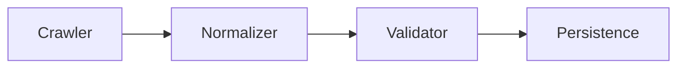
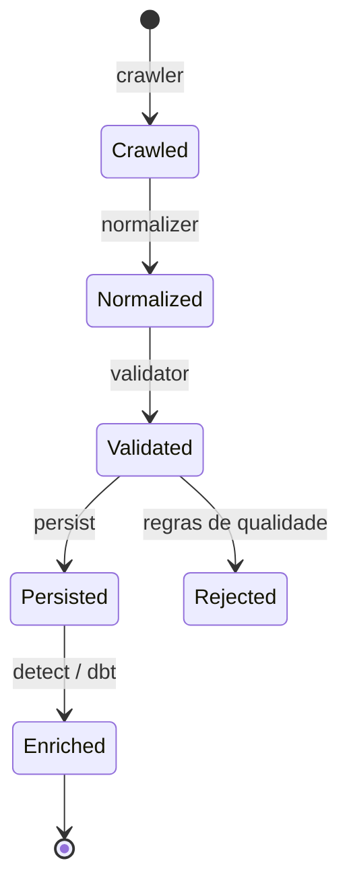
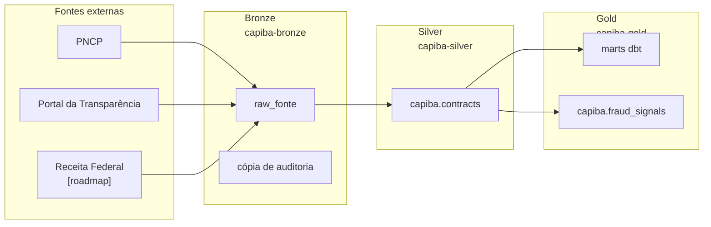

# Ingestão de Dados

## Visão geral

A camada de ingestão sai ao mundo e busca os dados públicos: extrai
contratações governamentais das APIs abertas, normaliza o que encontra em um
schema unificado e assenta o resultado no lago medallion e no grafo do
Capiba, prontos para a detecção.



## Fontes suportadas

### PNCP

O crawler do PNCP consulta `GET /v1/contratos`, o endpoint dos contratos já
firmados, com fornecedor e valores. A paginação e o retry estão implementados
no próprio crawler, com backoff exponencial compartilhado em
`src/capiba/ingestion/_http.py`; os detalhes da API (URL base, formato de
data, limites e rate limit) vivem em `docs/apis_fontes.md`.

### Portal da Transparência

O Portal da Transparência é consultado por `GET /contratos`, filtrado por
período e código SIAFI do órgão; `fetch_purchases` itera mês a mês sobre o
mesmo endpoint. A autenticação vai no header `chave-api-dados` (ver
`docs/apis_fontes.md`), e o mapeamento dos registros é defensivo, tolerando
variações de nomenclatura entre respostas.

## Schema unificado

### `Contract`

| Campo | Tipo | Descrição |
|-------|------|-----------|
| `id` | `str` | Identificador único |
| `process_number` | `str` | Número do processo administrativo |
| `subject` | `str` | Descrição do objeto contratado |
| `amount` | `Decimal` | Valor homologado/global |
| `signature_date` | `date` | Data de assinatura |
| `validity_start` | `date` | Início da vigência |
| `validity_end` | `date` | Fim da vigência |
| `buyer` | `Buyer` | Órgão público contratante |
| `supplier` | `Supplier` | Empresa/pessoa física contratada |
| `modality` | `str` | Modalidade da contratação |
| `status` | `str` | Situação do contrato |

## CLI de ingestão manual

O script `scripts/ingestion.py` é um wrapper fino sobre o framework
declarativo (`capiba.pipeline.runner`): monta uma spec em memória para as
fontes escolhidas e executa a fórmula `contracts_default` com a janela
explícita informada, sem depender do Airflow. O modo `--mock` usa dados de
exemplo (fontes `mock_pncp`/`mock_transparency`) em vez de chamar as APIs
externas, e `--dry-run` pula a persistência no ArangoDB (as escritas no
lake continuam best-effort):

```bash
# Simulação (dry-run)
python scripts/ingestion.py \
  --source pncp \
  --start-date 2026-01-01 \
  --end-date 2026-01-01 \
  --dry-run

# Persistir no ArangoDB
python scripts/ingestion.py \
  --source both \
  --start-date 2026-01-01 \
  --end-date 2026-01-31 \
  --persist
```

### Parâmetros

| Parâmetro | Valores | Descrição |
|-----------|---------|-----------|
| `--source` | `pncp`, `transparency`, `both` | Fonte de dados |
| `--start-date` | `YYYY-MM-DD` | Data inicial |
| `--end-date` | `YYYY-MM-DD` | Data final |
| `--dry-run` | flag | Não persiste no banco |
| `--persist` | flag | Habilita persistência no ArangoDB (dry-run desativa) |
| `--mock` | flag | Usa dados de exemplo em vez de chamar APIs externas |

> **Nota (CLI no host):** as escritas no lake exigem `ICEBERG_OAUTH2_CLIENT_ID`
> (`capiba-services`), `ICEBERG_OAUTH2_CLIENT_SECRET` (o mesmo do
> `keycloak.clientSecrets` do chart) e `ICEBERG_OAUTH2_SERVER_URI` apontando
> para o port-forward do Keycloak (`http://localhost:8182/...`). Mesmo assim,
> o pyiceberg no host falha no TLS self-signed do endpoint S3 vendido pelo
> Lakekeeper (`https://s3.capiba.local:8443`); para cargas que precisam do
> lake, prefira o backfill Airflow abaixo, que roda in-cluster.

## Carga retroativa (backfill)

Para acumular histórico (ex.: calibração de limiares de detecção), use o
backfill nativo do Airflow sobre a DAG `daily_ingestion`: cada dia lógico
roda o pipeline completo (crawl PNCP do dia anterior + Transparência do
mês corrente, normalize, destinos, dbt e detect) com retry por task:

```bash
# dentro do pod do Airflow
kubectl exec deploy/capiba-airflow -n capiba -c airflow -- \
  airflow backfill create --dag-id daily_ingestion \
  --from-date 2026-01-01 --to-date 2026-08-18 \
  --max-active-runs 3   # limita paralelismo (rate limits das APIs)
```

`--dry-run` lista os runs que seriam criados sem executar. O progresso pode
ser acompanhado pela UI do Airflow ou consultando o estado das `dag_run`
no metadata DB. O primeiro backfill de produção rodou em 2026-08-19
(jan/2026 → ago/2026) para alimentar a calibração do PR-D-03.

> **Post steps são pulados em runs de backfill.** `dbt_run` e `detect`
> reprocessam as tabelas silver/gold inteiras, então rodá-los por dia
> lógico é trabalho O(n²) e pesado em memória (OOMKills no backfill de
> 2026-08-19). O `task_post_step` levanta `AirflowSkipException` quando o
> `run_type` é `backfill`; ao final do backfill, dispare uma run regular
> (`airflow dags trigger daily_ingestion`, ou aguarde a schedule diária)
> para reconstruir os marts e os sinais sobre todo o acumulado.

## Pipelines declarativos (specs YAML)

Os pipelines de ingestão são **declarativos**: cada um é uma spec YAML em
`dags/pipelines/*.yaml`, sem código Python. No parse do Airflow,
`dags/pipeline_factory.py` carrega e valida cada spec
(`capiba.pipeline.spec.load_spec`) e gera uma DAG por spec com **tasks
granulares**: uma por fonte (`crawl_<fonte>`/`download_<fonte>`),
`normalize`/`validate` conforme a fórmula, uma por destino e uma por post
step, de modo que o scheduler do Airflow possa retentar falhas por etapa
(o runner de `src/capiba/pipeline/runner.py` executa a lógica de cada
passo). Uma spec
inválida é logada e pulada, sem derrubar o restante do DagBag. Inlets e
outlets OpenLineage são derivados da própria spec, alimentando o Marquez.

```yaml
# dags/pipelines/daily_contracts.yaml — pipeline diário de contratos públicos
name: daily_ingestion           # vira o dag_id (snake_case)
description: Daily ingestion of public contracts and bids
schedule: "0 6 * * *"           # cron do Airflow; omita para pipeline manual
window: previous_day            # janela temporal padrão das fontes
sources:
  - name: pncp                  # fonte do SOURCE_REGISTRY
  - name: transparency
    window: current_month       # override de janela só desta fonte
formula: contracts_default      # fórmula que orquestra os passos
validate:
  ruleset: contract_rules       # regras de qualidade (opcional)
transformations:                # transformações nomeadas (opcional)
  - name: filter_by_min_value
    params: { min_value: 1000 }
destinations:
  - lake_bronze                 # cópia de auditoria + tabela raw_<fonte>
  - lake_silver                 # tabela Iceberg capiba.contracts
  - arangodb_graph              # upsert das entidades no grafo
  - gold_report                 # relatório do run no bucket gold
post_steps:
  - dbt_run                     # marts gold via dbt
  - detect                      # sinais estatísticos de fraude no gold
```

Os post steps também disparam alertas best-effort por e-mail
(`src/capiba/notification/alerts.py`): o `detect` notifica os sinais com
score ≥ `NOTIFICATION_ALERT_SCORE` (default 0.7) e a validação notifica
relatórios inválidos ou com taxa de erros de normalização > 5%. Ambos são
no-op quando `NOTIFICATION_RECIPIENTS` está vazio e nunca derrubam a task.

### Registries

Os nomes do YAML resolvem para implementações via
`src/capiba/pipeline/registry.py`. As fontes (`SOURCE_REGISTRY`) são `pncp`,
`transparency`, `federal_revenue` (dump de arquivos), `pod_usage`
(metrics-server), `ceis` e `cnep` (listas de sanções), além de `mock_pncp` e
`mock_transparency` para rodar offline. Os normalizadores
(`NORMALIZER_REGISTRY`) fazem o mapeamento raw → `Contract` por fonte, e as
fontes mock reutilizam o normalizador da fonte que imitam. O único ruleset
(`RULESET_REGISTRY`) é `contract_rules`
(`src/capiba/quality/validators.py`). Fórmulas e destinos
(`FORMULA_REGISTRY`/`DESTINATION_REGISTRY`) são registrados pelo próprio
runner ao ser importado.

Para declarar uma fonte nova basta o YAML; para registrar uma capacidade
nova (fonte, normalizador, ruleset, fórmula ou destino) é preciso Python.
O registry é a fronteira entre os dois mundos.

### Fórmulas

**`contracts_default`** espelha o fluxo diário de contratos: crawl por fonte
(cada uma com sua janela), normalize, transformations (opcional), validate
(opcional) e destinos.

**`file_dump`** baixa arquivos de referência (ex.: dump CNPJ da Receita
Federal) e guarda os ZIPs no bronze junto de um manifesto; manifesto vazio
falha o run, porque uma ausência não pode ser registrada como sucesso.
Quando a spec declara os destinos `lake_silver`/`arangodb_graph` e a fonte
tem parser registrado (`DUMP_PARSER_REGISTRY`), uma etapa
`normalize_<fonte>` streaming faz o parse dos ZIPs de entidade
(Empresas/Estabelecimentos/Socios, em chunks, já que os dumps de GBs nunca
são materializados em memória) para as tabelas silver
`companies`/`establishments`/`partners`; arquivos de referência (Cnaes.zip
etc.) são pulados. Nesse caso o destino `lake_silver` apenas reporta as
contagens (a escrita já ocorreu no normalize) e `arangodb_graph` carrega o
grafo a partir do silver (vértices `companies`/`partners`, arestas
`partner_of`).

**`metrics_collect`** tira um snapshot pontual de métricas (ex.:
`pod_usage`) direto para os destinos, sem normalização nem validação; a
janela é ignorada.

**`entities_collect`** cuida do snapshot de uma lista de entidades, como as
listas de sanções CEIS/CNEP do Portal da Transparência (fontes `ceis` e
`cnep`): crawl por fonte (a janela é ignorada, pois a lista é um retrato
corrente), uma etapa `normalize_<fonte>` por fonte, que valida os registros
contra o modelo da entidade registrado no `ENTITY_NORMALIZER_REGISTRY` e
escreve na tabela silver da entidade (best-effort, como no file_dump). O
destino `lake_silver` apenas reporta as contagens e `lake_bronze` guarda o
payload bruto (`raw_ceis`/`raw_cnep`). A validação cruzada da spec exige
fetcher e entrada no `ENTITY_NORMALIZER_REGISTRY` para cada fonte.

### Janelas temporais

`src/capiba/pipeline/window.py` resolve os nomes declarados em um
`DateRange` a partir da execution date: `previous_day`, `current_month`,
`previous_month` e `all` (ilimitada). O `window` do pipeline é o padrão;
cada fonte pode sobrescrevê-lo (como o Portal da Transparência, coletado
pelo mês corrente inteiro no pipeline diário).

### Transformações customizadas

Transformações nomeadas vivem em `src/capiba/transformations/`, um módulo
por transformação, expondo `transform(records, **params)`, e são
referenciadas por nome no YAML, com `params` livres. Nomes fora do
`TRANSFORMATION_REGISTRY` são resolvidos importando
`capiba.transformations.<name>`.

### Validação da spec

Antes de qualquer execução, a spec passa por duas validações: estrutural
(pydantic, `extra="forbid"`, de modo que chave desconhecida falha) e cruzada
com os registries (fonte/fórmula/destino/ruleset/transformação desconhecidos
geram erro claro, com a lista de nomes conhecidos). Em runtime, o ruleset
declarado produz resultados por regra no relatório do run (destino
`gold_report`), e o runner registra métricas por passo (duração, linhas
de entrada/saída, erros) na tabela gold `platform_metrics`.

### DAGs atuais

**`daily_ingestion`** (`daily_contracts.yaml`, `0 6 * * *`): PNCP +
Transparência para bronze, silver, grafo ArangoDB e relatório gold, com os
post steps `dbt_run` (marts) e `detect`. O `detect` calcula sinais de fraude
sobre a tabela silver no vocabulário canônico da API: `anomalous_price`
por fornecedor (composto Benford + IsolationForest, componentes em
`details`), `single_bid` por fornecedor (taxa de modalidade não
competitiva, emitido só quando > 0 com ≥ 3 contratos), `concentration`
por órgão (HHI) e `anomalous_duration` por fornecedor (vigências outlier
IQR). A eles se soma o sinal de grafo `collusion_network`, computado
best-effort pelo `detect_collusion` sobre o ArangoDB com limiar
`DETECTION_COLLUSION_MIN_WINS` (default 3) e score binário 1.0. Todos são
materializados na tabela Iceberg gold `capiba.fraud_signals`.

**`monthly_federal_revenue`** (`monthly_federal_revenue.yaml`,
`23 5 2 * *`): baixa os arquivos de referência do dump CNPJ da Receita
do mês anterior (fórmula `file_dump`, subset via `FEDERAL_REVENUE_FILES`
ou `params.files`), grava os ZIPs em
`federal_revenue/files/dt=YYYY-MM-DD/` no bronze e registra o manifesto
na tabela `capiba.raw_federal_revenue`. Com os arquivos
Empresas*/Estabelecimentos*/Socios* habilitados (opt-in, GBs cada), a
task `normalize_federal_revenue` faz o parse streaming descrito na fórmula
`file_dump` e o destino `arangodb_graph` carrega o grafo, insumo dos
operadores de grafo em `src/capiba/detection/graphs.py`.

**`hourly_pod_usage`** (`hourly_pod_usage.yaml`, `7 * * * *`): coleta o
uso de CPU/memória dos pods do namespace (fórmula `metrics_collect`,
fonte `pod_usage`), insumo dos marts `pod_usage_hourly` e
`platform_cost_daily`.

**`weekly_sanctions`** (`weekly_sanctions.yaml`, `22 3 * * 2`): coleta as
listas de sanções CEIS (inidôneas/suspensas) e CNEP (empresas punidas) do
Portal da Transparência (fórmula `entities_collect`, fontes `ceis`/`cnep`,
crawler `fetch_sanctions` em `crawler_transparency.py`, modelo `Sanction`
em `src/capiba/ingestion/sanctions.py`), com payloads brutos nas tabelas
bronze `raw_ceis`/`raw_cnep` e registros normalizados na tabela silver
`sanctions`. Requer `TRANSPARENCY_API_KEY`; é o insumo de ingestão de um
futuro sinal "fornecedor sancionado" (pendente de pré-registro PR-D-03).

**`lake_maintenance`** (`dags/lake_maintenance.py`, semanal): única DAG
imperativa restante, executa `expire_snapshots` (retenção de 7 dias) e
`optimize` (compactação) em todas as tabelas Iceberg dos catálogos
bronze/silver/gold, via Trino.

## Persistência no grafo

Contratos são salvos na collection `contracts`. Fornecedores são salvos em
`suppliers` e conectados via aresta `won`. Compradores são salvos em
`buyers`. Empresas e sócios do dump CNPJ são salvos em `companies` e
`partners` (carga em lote por `bulk_upsert_cnpj`, a partir das tabelas
silver) e conectados via aresta `partner_of`.

## Ciclo de vida de um contrato

Um contrato percorre as etapas do pipeline desde a coleta até o
enriquecimento com sinais de fraude.



## Data lake (medallion + Iceberg)

Em paralelo ao grafo, o pipeline (`src/capiba/pipeline/lake.py`) grava no
MinIO em modelo medallion, com dois formatos por camada:



No **bronze** (`capiba-bronze`) ficam a cópia de auditoria bruta
(`<fonte>/dt=YYYY-MM-DD/*.json.gz`) e a tabela Iceberg
`capiba.raw_<fonte>`, uma linha por execução com o payload completo em
`payload_json`, particionada por `dt`. Na **silver** (`capiba-silver`) vive
a tabela Iceberg `capiba.contracts`, com os contratos normalizados e
tipados (datas, `decimal(18,2)`, structs `buyer`/`supplier`), particionada
por `dt`. O **gold** (`capiba-gold`) guarda os relatórios de execução em
`reports/daily_ingestion/dt=YYYY-MM-DD/*.json.gz`, os marts Iceberg
construídos pelo dbt (`capiba.contracts_daily`, `capiba.contracts_by_agency`,
`capiba.supplier_stats`, `capiba.data_quality_daily`,
`capiba.pod_usage_hourly`, `capiba.platform_cost_daily`) e a tabela
`capiba.platform_metrics`, com as métricas por passo de cada run escritas
pelo runner em regime best-effort. Fora do lago, o **serving** (PostgreSQL
DWH) recebe os modelos de `dbt/models/serving/` (`serving_supplier_stats`,
`serving_municipality_daily`), materializados no database `dwh` através do
catálogo Trino `dwh`: camada de baixa latência para consumo direto.

As tabelas Iceberg (arquivos Parquet + metadados) são catalogadas pelo
**Lakekeeper** (REST catalog, serviço `capiba-iceberg-catalog` no cluster),
com um warehouse por bucket (`bronze`, `silver`, `gold`), provisionados por
`make init-buckets`. Os clientes Python usam `pyiceberg`; o dbt usa
`dbt-trino`, executando todo o SQL pelo **Trino** (um catálogo por warehouse)
contra o catálogo gold.

Para rodar sem cluster, basta apontar `ICEBERG_CATALOG_URI` para um catálogo
SQLite local (`sqlite:////caminho/catalog.db`) com `ICEBERG_LOCAL_WAREHOUSE`
definido, e o lake grava em disco local.

A escrita no lake é *best-effort*: falhas não interrompem o pipeline. Os
buckets e warehouses são configuráveis via variáveis de ambiente
(`LAKE_BUCKET_*`, `ICEBERG_*`; ver `.env.example`).

### dbt

O projeto dbt fica em `dbt/` (profile `capiba`, dbt-trino; alvo = catálogo
`gold`, fonte = catálogo `silver`). Para executar localmente contra o
cluster (com os port-forwards ativos):

```bash
make dbt-run   # constrói os marts gold
make dbt-test  # testes de fonte/modelo + freshness das fontes
```

## Linhagem

Cada execução registra nós de fonte, transformação e dataset via
`LineageTracker`, permitindo auditoria da origem dos dados.

## Testes

```bash
make test
```

Os testes de ingestão cobrem o mapeamento PNCP e Portal da Transparência,
a paginação e o 204 No Content no crawler, a detecção de duplicatas e o
checksum, a persistência e a criação de arestas no ArangoDB, e o framework
declarativo ponta a ponta: validação de specs (`test_pipeline_spec.py`),
janelas (`test_pipeline_window.py`), runner (`test_pipeline_runner.py`),
factory de DAGs (`test_pipeline_factory.py`) e a feature BDD
`tests/bdd/features/pipeline_framework.feature`.
