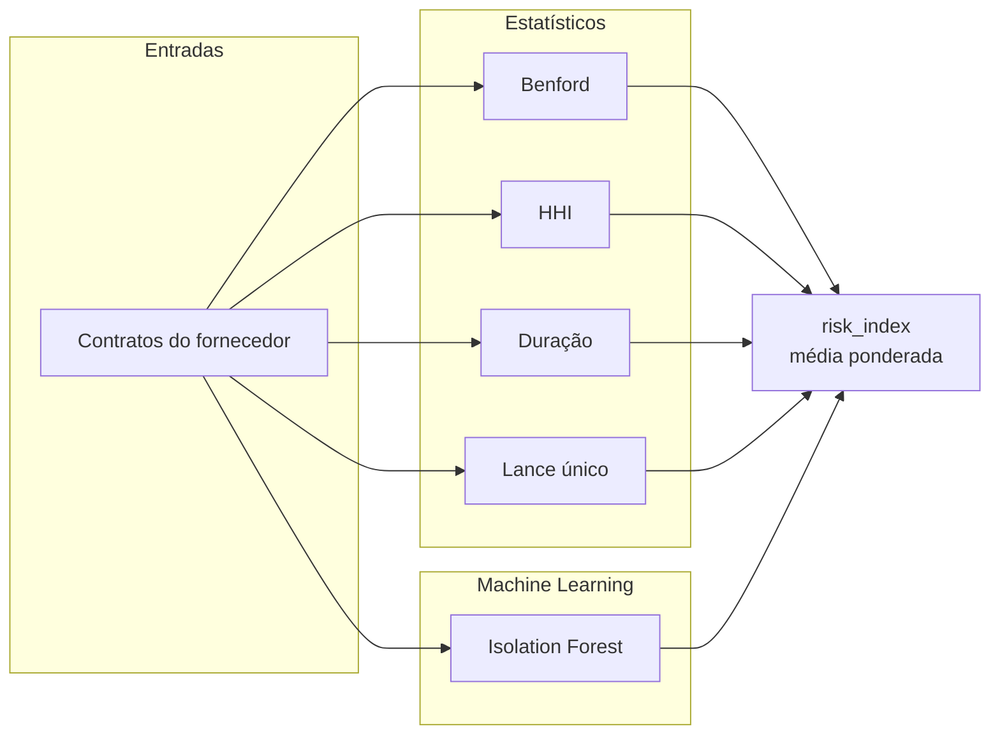

# Operadores de detecção

> **Propósito:** catálogo único dos operadores de detecção — scores,
> limiares, validações e status de conexão à API e ao pipeline.
> **Quando consultar:** ao criar, calibrar ou conectar um sinal de
> detecção.
> **Relacionados:** `docs/preregistrations/README.md` (índice de baterias),
> `docs/ingestao.md` (dados de entrada).
> **Sincronizado com:** `src/capiba/detection/` — 2026-08-21.

Catálogo único dos operadores de detecção da plataforma. Cada operador é uma
lente sobre os mesmos contratos: uns leem a estatística dos números, outros
aprendem o formato da anomalia, outros seguem os fios do grafo ou o
significado do texto. O status indica se o operador já está conectado à API
(`/v1/signals`) e ao pipeline em runtime, ou se ainda é scaffold à espera de
um consumidor.

A computação bruta dos sinais vive em `src/capiba/detection/signals.py`,
fonte única de verdade que inclui o enum canônico `SignalType`. O post step
`detect` do pipeline (`detect_fraud_signals`) emite scores brutos por
entidade na tabela gold `fraud_signals` com os mesmos nomes da API
(`single_bid`, `concentration`, `anomalous_price`, `anomalous_duration`) e,
best-effort (nunca derrubam a task), os sinais de screening e cruzamento
(`sanctioned_supplier`, `sanctioned_name_match`, `political_connection`,
`anomalous_geography`, `notice_clone`) e o sinal de grafo
(`collusion_network`) — todos no
vocabulário canônico `SignalType` —, enquanto a API aplica seus próprios
limiares de emissão e mensagens de evidência sobre as mesmas funções.

## Composição do índice de risco

Os operadores consomem os contratos de um fornecedor e alimentam o
`risk_index` retornado pela API, uma média ponderada dos sinais emitidos.

## Estatísticos (`detection/statistical.py`)

Os operadores que não precisam de modelo treinado: bastam amostra e
aritmética.

| Operador           | O que captura                                  | Implementação           | Status        |
| ------------------ | ---------------------------------------------- | ----------------------- | ------------- |
| Lei de Benford     | Desvio na distribuição dos primeiros dígitos   | `scipy.stats.chisquare` | API/pipeline  |
| Lances únicos      | Proporção de licitações com participante único | Proporção simples       | API/pipeline  |
| Concentração (HHI) | Índice de dependência comprador-fornecedor     | `pandas` groupby        | API/pipeline  |
| Duração anômala    | Prazos fora da média setorial                  | z-score / IQR           | API/pipeline  |

Duas ressalvas de implementação. Os contratos persistidos não armazenam
`numero_participantes`, então a API e o pipeline usam a modalidade não
competitiva (dispensa ou inexigibilidade) como proxy de lance único
(`single_bid_score`). E Benford só fala com amostra: exige no mínimo 10
valores positivos. No pipeline, o sinal `anomalous_price` é o composto
`max(benford_deviation, isolation_forest_rate)` por fornecedor, com os
componentes preservados em `details`, e `single_bid` só é emitido quando a
taxa é positiva e o fornecedor tem pelo menos 3 contratos.

## Machine Learning (`detection/ml_models.py`)

| Modelo           | Uso                                  | Status       |
| ---------------- | ------------------------------------ | ------------ |
| Random Forest    | Classificação de colusão/favoritismo | Scaffold     |
| Isolation Forest | Detecção não-supervisionada          | API/pipeline |
| CRI composto     | Índice combinando sinais             | Scaffold     |

O IsolationForest só é treinado quando o fornecedor tem 15 ou mais contratos
(`random_state` fixo, determinístico), e alimenta o componente
`isolation_forest_rate` do `anomalous_price`. O índice de risco composto da
API não passa pelo `compute_cri`: é calculado em `api/services.py` como média
ponderada dos sinais emitidos (pesos 0.35, 0.35, 0.15 e 0.15, renormalizados
sobre os sinais presentes), com alerta a partir de 0.7.

## Grafos (`detection/graphs.py`)

Onde a estatística vê números, o grafo vê relações: quem ganha de quem, quem
é dono de quem.

| Operador              | O que captura                                                   | Status                                                     |
| --------------------- | --------------------------------------------------------------- | ---------------------------------------------------------- |
| Colusão em rede       | Pares de fornecedores alternando vitórias para o mesmo comprador | Pipeline (sinal `collusion_network`, validado nas baterias D-02 e D-03d) |
| Cadeia de propriedade | Beneficial ownership                                            | API (`GET /v1/graph/ownership/{cnpj}`)                     |

A colusão em rede aceita ainda o refinamento `min_buyers`
(`DETECTION_COLLUSION_MIN_BUYERS`, default 1, bateria D-03b), que exige o
par alternando vitórias em pelo menos N compradores distintos. O limiar
`DETECTION_COLLUSION_MIN_WINS` (default 3) é placeholder validado por D-02;
a calibração em volume real (D-03/D-03b) ficou inconclusiva, e a bateria
D-03d validou o ponto (min_wins 5, min_buyers 2) — promovê-lo aos defaults
é candidato a um refinamento pré-registrado (PR-D-03e). O score é binário.

Guarda de escala: a derivação de pares é **pulada** quando a projeção
(Σ C(n,2) por comprador, `graphs.projected_pair_count`) excede
`DETECTION_COLLUSION_MAX_PAIRS` (default 1.000.000) — 9,6M pares OOMKillaram
o pod na primeira run real (2026-08); o snapshot de elegibilidade segue
gravado como evidência. O blocking de recall exato
(`blocked_supplier_index`, predicado `|B(s)| ≥ min_buyers`) foi provado
equivalente bit a bit em D-03c, mas refutado nos pontos permissivos ((3,2)
e (3,3) seguem acima da guarda). O backlog legado (anterior ao top-K) não é
reprocessado.

Desde
2026-08-21 a emissão em produção é **ranqueada com orçamento editorial**
(emissão top-K da bateria D-03d, success T1–T9): a derivação usa blocking
(`pair_buyers_from_eligibility_blocked`) e emite os
top-`DETECTION_COLLUSION_TOP_K` pares (default 500; ordenação
`buyer_count`/`wins_sum` desc, par asc), com `top_k` e `qualified_count`
no descriptor do pacote de evidência.

## Screening e cruzamento (`detection/screening*.py`, `political.py`, `geography.py`)

Os operadores que cruzam os contratos silver com bases externas (sanções,
TSE, Receita Federal): menos estatística, mais confronto de fatos. Todos
são emitidos best-effort no `task_detect`.

| Operador                | O que captura                                                                                          | Status                                                        |
| ----------------------- | ----------------------------------------------------------------------------------------------------- | ------------------------------------------------------------- |
| `sanctioned_supplier`   | Match exato por documento (CNPJ/CPF) contra a silver `sanctions` (CEIS/CNEP/CEAF) vigente na assinatura; score binário 1.0 — nome nunca é evidência | Pipeline (`detection/screening.py`, bateria D-06) |
| `sanctioned_name_match` | Screening fuzzy nome + documento mascarado, com veto por documento divergente; score 0,6·nome + 0,4·documento, limiares 0,85/0,95 | Pipeline (`detection/screening_fuzzy.py`, bateria D-06b)      |
| `political_connection`  | Doador de campanha de prefeito eleito que vira fornecedor do município na janela do mandato; cinco gates (documento exato, eleito, temporal, piso R$ 1.000, share ≥ 0,05; score `share/0,25`) | Pipeline (`detection/political.py`, bateria D-08)             |
| `anomalous_geography`   | Distância entre a sede do fornecedor PJ e o município comprador (haversine, gate estrito 100 km, score `distância/1000`); PF e pares sem elo de de-para nunca sinalizam | Pipeline (`detection/geography.py`, bateria D-09)             |

A fonte de lat/long da geografia é a silver `municipalities` mais a cadeia
`establishments` → `rfb_municipalities` → referência de municípios
(`ingestion/geography.py`); o operador AQL legado de `graphs.py` foi
removido. Detecção adjacente: a resolução de entidades
(`detection/entities.py`, bateria D-07) grava arestas `same_as`
persons↔persons no grafo ao final da carga FtM (score 0,6 nome + 0,3
documento mascarado + 0,1 faixa etária, limiar `DETECTION_ENTITY_THRESHOLD`
default 0,85), sem colapsar vértices.

Os pares candidatos do `sanctioned_name_match` passam por **prefilter
vetorizado exato** (cota superior da ratio do SequenceMatcher via interseção
de multiset de caracteres; equivalência bit-a-bit guardada por
`TestIndexedImplementationEquivalence`) — o produto cruzado documentless
levaria horas em volume real (570M pares, medido em 2026-08). O piloto de
PEPs via yente/OpenSanctions (`br_pep`) foi **refutado** por D-12
(`docs/results/R-D-12.md`): o logic-v2 não supera o matcher local no regime
documentless (precisão 0,8272, revocação 0,517 no OS Pairs); o adapter
testado vive em `detection/pep_screening.py`, arquivado sem sinal novo.

No `political_connection`, o match é exato por documento (originário
prioritário — nome nunca é evidência) e a janela do mandato é derivada de
`TSE_ELECTION_YEAR`. O mart gold `political_connections` publica os sinais
enriquecidos com as silvers TSE (última partição) e a seed
`dbt/seeds/ue_siafi_crosswalk.csv` (incremental, piloto Recife: UE 25313,
SIAFI 2531); LGPD: CPF mascarado padrão CEAF, CNPJ completo, chave
`signal_id` sha256. A CDN do TSE bloqueia clientes CLI por IP (403); o
PR-D-08b pré-registra a troca da fonte para a Base dos Dados
(`br_tse_eleicoes`, bateria de paridade `tse_parity` — o gate do eleito
migra para `resultados_candidato` e a BD zera o doador originário, perda de
revocação medida por P5).

Fora do vocabulário `SignalType`, mas já em produção nos marts gold, os
red flags determinísticos: `detection/red_flags.py` (CRI Fazekas & Kocsis
por contrato, flag nula = dado insuficiente, bateria D-04) e
`detection/amendments.py` (flags de aditivo por sequência de observações
bronze, bateria D-05) alimentam os marts `contract_red_flags`,
`red_flags_by_*`, `contract_amendments` e `amendments_by_*` via dbt.

## NLP (`detection/nlp_operators.py`, `detection/notice_clone.py`)

| Operador        | O que captura               | Técnica                          | Status        |
| --------------- | --------------------------- | -------------------------------- | ------------- |
| Gap semântico   | Sub-declaração de escopo    | Similaridade coseno (embeddings) | Scaffold      |
| Clone de edital | Near-duplicate entre órgãos | Sentence transformers            | Pipeline      |

O sinal `notice_clone` (`detection/notice_clone.py`, PR-D-10, refinamento
D-10b success 7/7 — o exploratório D-10 fixou as âncoras N0/N6 e as bandas
P3/P4 e refutou a P2 original; a forma corrigida P2b, rank ≤ 4, foi
validada) detecta editais clonados/direcionados sobre os textos
bronze do Querido Diário: segmentação de edições
(`ingestion/gazette_segments.py`), similaridade coseno estrita acima de
`DETECTION_NOTICE_CLONE_THRESHOLD` (default 0,85), veto de reedição por
número de processo e encoder pinado; emitido best-effort no `task_detect`
pelo produtor `notice_clone_bronze_signals`. O `semantic_gap` segue sem
consumidor: `SignalType.SEMANTIC_GAP` existe no vocabulário canônico à
espera de um produtor e de fonte.
