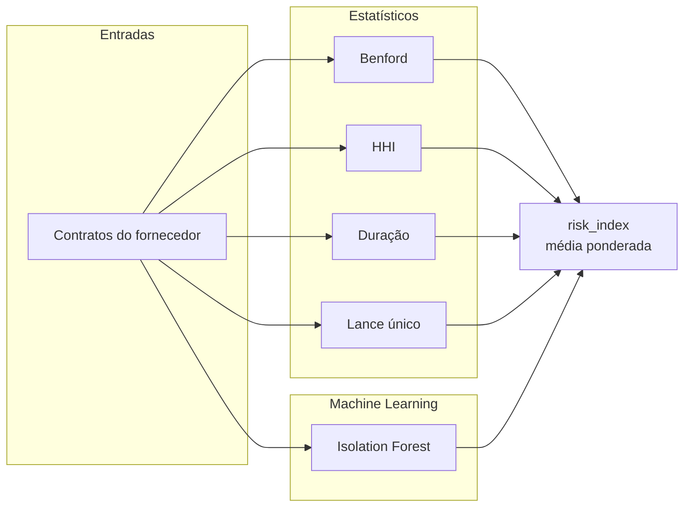

# Operadores de Detecção — Capiba

Catálogo único dos operadores de detecção. O status indica se o operador está
conectado à API (`/v1/signals`) em runtime ou se é scaffold sem consumidor.

## Composição do índice de risco

Os operadores consomem os contratos de um fornecedor e alimentam o
`risk_index` retornado pela API.

## Estatísticos (`detection/statistical.py`)

| Operador           | O que captura                                  | Implementação           | Status |
| ------------------ | ---------------------------------------------- | ----------------------- | ------ |
| Lei de Benford     | Desvio na distribuição dos primeiros dígitos   | `scipy.stats.chisquare` | API    |
| Lances únicos      | Proporção de licitações com participante único | Proporção simples       | API    |
| Concentração (HHI) | Índice de dependência comprador-fornecedor     | `pandas` groupby        | API    |
| Duração anômala    | Prazos fora da média setorial                  | z-score / IQR           | API    |

Nota: os contratos persistidos não armazenam `numero_participantes`; a API usa
modalidade não competitiva (dispensa/inexigibilidade) como proxy de lance
único ao alimentar `single_bid_rate`. Benford exige no mínimo 10 valores.

## Machine Learning (`detection/ml_models.py`)

| Modelo           | Uso                                  | Status   |
| ---------------- | ------------------------------------ | -------- |
| Random Forest    | Classificação de colusão/favoritismo | Scaffold |
| Isolation Forest | Detecção não-supervisionada          | API      |
| CRI composto     | Índice combinando sinais             | Scaffold |

Nota: IsolationForest só é treinado quando o fornecedor tem 15 ou mais
contratos. Na API, o índice de risco composto é calculado em
`api/services.py` (média ponderada dos sinais emitidos, pesos 0.35/0.35/0.15/
0.15, alerta a partir de 0.7), não por `compute_cri`.

## Grafos (`detection/graphs.py`) — scaffold

| Operador              | O que captura                                 |
| --------------------- | --------------------------------------------- |
| Colusão em rede       | Subgrafos densos (bid-rigging)                |
| Cadeia de propriedade | Beneficial ownership                          |
| Geografia anômala     | Fornecedores dispersos, vitórias concentradas |

## NLP (`detection/nlp_operators.py`) — scaffold

| Operador        | O que captura               | Técnica                          |
| --------------- | --------------------------- | -------------------------------- |
| Gap semântico   | Sub-declaração de escopo    | Similaridade coseno (embeddings) |
| Clone de edital | Near-duplicate entre órgãos | Sentence transformers            |
